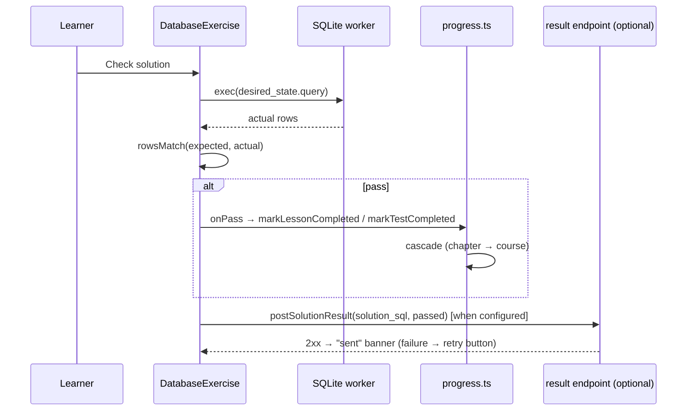

# The database runtime — implementation guide

How database exercises work under the hood: the runtime plumbing, the SQLite
engine port, the exercise/test islands, storage, and how to add a second
database engine (pglite). Authoring is covered in
[docs/user/database-exercises.md](../user/database-exercises.md).

Lineage note: the engine, comparator, viewer, and playground are ports from
**lite-learner** (sibling project, same ancestry); its Development Guide
documents the original design decisions in more depth.

## Contents

- [Architecture at a glance](#architecture-at-a-glance)
- [The runtime plumbing](#the-runtime-plumbing)
- [The SQLite engine](#the-sqlite-engine)
- [The exercise island and its parents](#the-exercise-island-and-its-parents)
- [Sequence diagrams](#sequence-diagrams)
- [Storage](#storage)
- [The playground](#the-playground)
- [Adding a database engine (pglite walkthrough)](#adding-a-database-engine-pglite-walkthrough)
- [Known quirks](#known-quirks)

## Architecture at a glance

```
content frontmatter (database: / test_database:)
        │  validated by src/content.config.ts (zod), gated by
        │  validateRuntimes() in src/lib/content/bundle.ts
        ▼
LessonApp / TestApp  ──owns persistence──►  IndexedDB row
        │                                   (solution / test_solution)
        ▼
DatabaseExercise.svelte  ──owns the engine──►  RuntimeAdapter (registry)
        │                                           │
        ▼                                           ▼
SqlEditor + DbViewer                       DatabaseSession (SqlClient)
                                                    │ postMessage protocol
                                                    ▼
                                           Web Worker (sqlite-wasm,
                                           in-memory database)
```

## The runtime plumbing

Four small modules in `src/lib/runtimes/` (shared by all current and future
code-exercise kinds):

| Module        | Role |
| ------------- | ---- |
| `config.ts`   | `RUNTIMES` — the site's enabled runtime ids, injected from `astro.config.mjs`'s exported `runtimes` const via a Vite define (`PUBLIC_RUNTIMES`) |
| `info.ts`     | `RUNTIME_INFO` — static id → label + npm packages, for error messages. **Kept in sync by hand** with `scripts/check-runtimes.mjs` (plain node, can't import TS) |
| `registry.ts` | id → lazy adapter loader; `loadRuntime(id)` refuses disabled/unknown ids. Lazy imports mean disabled engines are never bundled |
| `types.ts`    | the contracts: `RuntimeAdapter` (id, label, kind, `editorLanguage()`, `createSession()`, optional `precacheAssets()`) and `DatabaseSession` |

Enforcement happens at three layers, earliest wins:

1. **Preflight** (`scripts/check-runtimes.mjs`, npm `predev`/`prebuild`):
   resolves every enabled runtime's packages; prints the `npm install` fix.
2. **Build gate** (`validateRuntimes()` in `src/lib/content/bundle.ts`,
   called from `loadCourseTrees()`): content whose block names a disabled or
   unknown runtime fails the build with the file id + install hint.
3. **Runtime** (`loadRuntime()`): throws on disabled/unregistered ids — in
   practice unreachable for shipped content because of layer 2.

## The SQLite engine

`src/lib/runtimes/sqlite/` — the lite-learner port, near-verbatim:

- **`worker.ts`** — owns a single **in-memory** SQLite database inside a Web
  Worker, so a slow or looping query never freezes the tab. In-memory only,
  no OPFS, *on purpose*: OPFS needs SharedArrayBuffer → COOP/COEP headers
  that many static hosts can't set. Alongside exec, it implements
  `validate` (prepare-only compile via `sqlite3_prepare_v3`), a hand-rolled
  `.dump` (the WASM build has no shell; handles generated columns, virtual
  tables' shadow tables, index/trigger/view ordering), binary `serialize`
  via `sqlite3_js_db_export`, and per-table `exportJson`.
- **`protocol.ts`** — the `{ id, type, …payload }` request /
  `{ id, ok, result|error }` response message types.
- **`client.ts`** — `SqlClient`, a promise-per-message wrapper; `destroy()`
  terminates the worker (the runaway-query escape hatch) and rejects
  pending calls.
- **`comparator.ts`** (+ `comparator.test.ts`, 25 cases) — the pure solution
  checker: positional row comparison, expected-value-driven coercion
  (null / integer-exact / real-epsilon / boolean→0|1 / strict string). The
  coercion rules are deliberately **SQLite-flavored** — see the pglite
  section.
- **`adapter.ts`** — the ~20-line `RuntimeAdapter`: lazy
  `@codemirror/lang-sql` for the editor, `new SqlClient()` for sessions
  (structurally a `DatabaseSession`, plus the optional `serialize`/
  `exportJson` the playground uses).

The `@sqlite.org/sqlite-wasm` package is excluded from Vite dep
pre-bundling in `astro.config.mjs` (breaks its worker/asset URL resolution
in dev otherwise).

## The exercise island and its parents

**`src/components/exercise/DatabaseExercise.svelte`** owns the engine and
the workspace UI (editor via `SqlEditor` → the shared `CodeEditor` chassis,
Run/Check/Reset toolbar, results table, `DbViewer`). It deliberately owns
**no persistence** — the parent passes callbacks, which is what lets one
component serve both contexts:

| Prop | Lesson (`LessonApp`) | Chapter test (`TestApp`) |
| ---- | -------------------- | ------------------------ |
| `initialSolution` | `Lessons.solution` | `Chapters.test_solution` |
| `onSave(sql)` | writes `solution` | writes `test_solution` |
| `onPass()` / `onMarkDone()` | `markLessonCompleted` | `markTestCompleted` |
| `endpoint`/`meta` | lesson `result_endpoint`, kind `quiz` | chapter `result_endpoint`, kind `test` |

Behavioral contract (lite-learner's rules, kept exactly):

- **Restore without executing.** A saved buffer can't reproduce accumulated
  database state, so on load the buffer is restored, the DB is re-seeded
  fresh, and a banner says to re-run.
- **Check = state comparison.** `session.exec(desired_state.query)` →
  `rowsMatch(expected, actual)`. Pass → `onPass()` → the normal completion
  cascade (`src/lib/progress.ts`, which treats all three test variants
  uniformly in `maybeCompleteChapter`).
- **Reset** clears the buffer (persisted as null) and re-seeds.
- **result_endpoint**: every Check POSTs `solution_sql` + `passed` via
  `postSolutionResult()` in `src/lib/assessment/submit.ts` (same envelope +
  `x-sender-*` headers as question submissions). Check is profile-gated;
  Run stays free.
- **Runaway queries**: `running` disables the toolbar; after 2 s a Stop
  button appears → `stopAndRestart()` destroys the worker, boots a fresh
  session from the kept adapter reference, re-seeds, keeps the buffer.

## Sequence diagrams

### Lesson load

```mermaid
sequenceDiagram
    participant Page as [lesson].astro (static)
    participant LA as LessonApp
    participant DE as DatabaseExercise
    participant R as registry
    participant W as SQLite worker

    Page->>LA: mount (course/chapter/lesson payloads)
    LA->>LA: syncCourse/Chapter/Lesson (content-hash cache)
    LA->>LA: markLessonOpened (stamp started)
    LA->>DE: mount (block, row.solution, callbacks)
    DE->>R: loadRuntime('sqlite')
    R-->>DE: adapter (lazy import)
    DE->>W: createSession → new Worker
    DE->>W: reset(); exec(initial_sql)
    DE->>W: listTables(); tableData(first)
    W-->>DE: viewer data
    DE->>DE: restore saved buffer (NOT executed) + banner
```

### Check flow



### Runaway-query recovery

```mermaid
sequenceDiagram
    participant U as Learner
    participant DE as DatabaseExercise
    participant W1 as worker (stuck)
    participant W2 as worker (fresh)

    U->>DE: Run (infinite query)
    DE->>W1: exec(sql)
    Note over DE: running=true, toolbar disabled<br/>after 2s: Stop appears
    U->>DE: Stop
    DE->>W1: destroy() (terminate)
    DE->>W2: adapter.createSession()
    DE->>W2: reset(); exec(initial_sql)
    Note over DE: buffer untouched, banner explains
```

## Storage

Progress fields on the IndexedDB rows (`src/lib/db/types.ts`):

- `Lessons.solution: string | null` — the lesson buffer.
- `Chapters.test_solution: string | null` — the test buffer.
- Completion is the usual nullable timestamps; a database test stamps
  `test_completed` like a question test, so overview badges, the
  continue logic, and reset-progress (which nulls the solutions) all work
  unchanged.

Schemaless IDB means these fields needed no migration; `sync.ts` supplies
defaults and backup export covers them automatically. The exercise
definition itself (`database`/`test_database`) rides in the cached-content
half of the row and refreshes via `content_hash` without touching progress.

## The playground

`src/components/playground/SqlitePlayground.svelte`, registered in the
shell's `PLAYGROUNDS` map (`PlaygroundApp.svelte`) and lazy-loaded when its
tab activates. Persistence is the per-runtime `playground` store
(`src/lib/playground.ts`, migration v2): `buffers.main` autosaves the
editor; **Save snapshot** stores `dump(true)` SQL that's re-run on the next
load (with a >1 MB confirmation, since it's stored in the browser and
replayed at boot). Exports go through the session's `dump` /
`serialize` / `exportJson` — the latter two are *optional* on
`DatabaseSession`, so engines that can't produce them just hide those menu
entries.

## Adding a database engine (pglite walkthrough)

The intended extension path — everything is additive:

1. **`src/lib/runtimes/pglite/`** — implement `DatabaseSession` over
   [pglite](https://pglite.dev/) in a Web Worker (mirror
   `sqlite/worker.ts` + `client.ts`; pglite ships its own worker helpers you
   may use instead). Required: `reset`, `exec` (rows as objects),
   `validate`, `listTables`, `tableData`, `dump`. Optional: `serialize`,
   `exportJson`.
2. **`adapter.ts`** — `{ id: 'pglite', label: 'PostgreSQL', kind:
   'database', editorLanguage: () => sql({ dialect: PostgreSQL }),
   createSession }`. `@codemirror/lang-sql` already ships the PostgreSQL
   dialect.
3. **Register** in `registry.ts` (`pglite: () => import('./pglite/adapter')…`),
   add the id to `RUNTIME_INFO` in `info.ts`, and mirror the package list in
   `scripts/check-runtimes.mjs` (the hand-synced copy).
4. **Assets**: pglite is a few MB of WASM — implement `precacheAssets()` if
   its files aren't plain hashed imports, and check dev-mode behavior (it
   may need its own `optimizeDeps.exclude` entry like sqlite-wasm).
5. **Content**: `database: { runtime: pglite, … }` — the schema, build
   gate, exercise island, and playground shell all pick it up with no
   further changes. Add a `PglitePlayground` entry to `PLAYGROUNDS` (or
   generalize `SqlitePlayground` — it's engine-agnostic except its intro
   copy).

**Dialect caveats to document with the new runtime:**

- The comparator's coercion is SQLite-flavored: `true/false` expect `1/0`
  because SQLite has no boolean type — Postgres returns *real* booleans, so
  either the pglite session normalizes booleans to 1/0, or the comparator
  grows engine-aware boolean handling. Decide before shipping content.
- Introspection recipes differ entirely: `information_schema` +
  `pg_catalog` instead of `sqlite_master` + `pragma_*`. The user doc needs
  a Postgres recipes section.
- `dump` must be hand-written for pglite too (no `pg_dump` in the browser).

## Known quirks

- **Dev content-sync phantom lessons**: editing a chapter/course `index.md`
  while `npm run dev` runs can re-ingest it into the *lessons* collection
  (Astro's incremental sync misses the glob's `!**/index.md` exclusion),
  persisting a phantom entry in `.astro/`. `loadCourseTrees()` filters any
  "lesson" whose id equals a course/chapter id, so pages keep working;
  `rm -rf .astro` clears a poisoned store.
- **Boot races**: toolbar buttons are disabled until the engine boots;
  automation (and fast humans) clicking Run immediately after navigation
  will no-op. This is by design — the alternative is queuing input against
  an engine that may fail to boot.
- **`pragma_table_info` on a missing table returns zero rows, not an
  error** — good for checks (they just fail), occasionally surprising when
  debugging.
