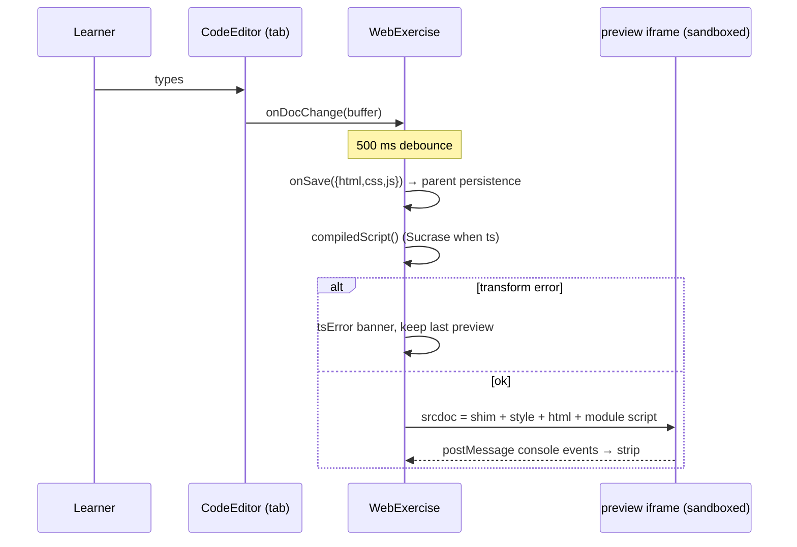

# The web runtime — implementation guide

How web-preview exercises work: the workspace component, srcdoc assembly
and sandboxing, the Sucrase pipeline, console capture, exports (zip +
screenshot), and the playground reuse. Authoring is covered in
[docs/user/web-exercises.md](../user/web-exercises.md); the shared runtime
plumbing (config, registry, preflight, build gate) is documented in
[database-runtime.md](database-runtime.md#the-runtime-plumbing) and applies
identically — `web` is a runtime *id* for gating purposes, but unlike
database engines it's a **singleton kind with no adapter**: there's no
engine session, just the browser itself.

## Contents

- [Architecture at a glance](#architecture-at-a-glance)
- [The WebExercise component](#the-webexercise-component)
- [Preview assembly & sandboxing](#preview-assembly--sandboxing)
- [The Sucrase pipeline](#the-sucrase-pipeline)
- [Console capture](#console-capture)
- [Exports](#exports)
- [Sequence diagrams](#sequence-diagrams)
- [Storage & parents](#storage--parents)
- [The playground](#the-playground)
- [Known limitations](#known-limitations)

## Architecture at a glance

```
content frontmatter (web: / test_web:)
        │  zod in src/content.config.ts; runtime 'web' gated by
        │  validateRuntimes() in src/lib/content/bundle.ts
        ▼
LessonApp / TestApp / WebPlayground ──persistence──► IndexedDB
        │   (solution / test_solution as {html,css,js} · playground store)
        ▼
WebExercise.svelte
  ├─ 3× CodeEditor (always mounted; Emmet on HTML/CSS)
  ├─ live preview: srcdoc iframe, sandbox="allow-scripts"
  │    └─ console shim ──postMessage──► console strip
  └─ exports: fflate zip · modern-screenshot PNG (temp iframe)
```

## The WebExercise component

`src/components/exercise/WebExercise.svelte` follows the same
**persistence-agnostic** pattern as `DatabaseExercise`: it owns the editors,
preview, console, and exports; the parent owns storage and completion via
props:

| Prop | Lesson (`LessonApp`) | Test (`TestApp`) | Playground (`WebPlayground`) |
| ---- | -------------------- | ---------------- | ---------------------------- |
| `initialSolution` | `Lessons.solution` | `Chapters.test_solution` | playground `buffers` |
| `onSave(buffers)` | lesson row | chapter row | `savePlaygroundBuffers` |
| `onSubmit` | `markLessonCompleted` | `markTestCompleted` | `null` (hides Submit) |
| `endpoint`/`meta` | lesson `result_endpoint` | chapter `result_endpoint` | — |
| `wide` | false (two-column page) | true (side-by-side) | true |
| `exportName` | lesson leaf | `<chapter>-test` | `playground` |

Component decisions worth knowing:

- **All three editors stay mounted** (panes toggled with `hidden`), so
  CodeMirror state — including undo history — survives tab switches. The
  cost is three editor instances per workspace; acceptable.
- Edits debounce 500 ms into a combined *save + preview rebuild*.
- **Emmet** (`@emmetio/codemirror6-plugin`): `abbreviationTracker()` on the
  HTML editor, `abbreviationTracker({ syntax: 'css' })` on CSS, plus a
  keymap binding Tab/Ctrl-E to `expandAbbreviation` (the command returns
  false when no abbreviation is active, so Tab falls through to CodeMirror's
  default focus behavior).
- Completion is `onSubmit` only — no evaluation of any kind, by design.

## Preview assembly & sandboxing

`buildDocument()` composes a full HTML document from the three buffers:
user HTML as **body content**, CSS in a `<style>`, the (possibly
transpiled) script as a `<script type="module">`, plus the console shim.
Two structural guards replace `</style` / `</script` inside the respective
buffers so user code can't break out of its wrapper tags (a correctness
guard, not a security one).

The live preview iframe uses **`srcdoc` + `sandbox="allow-scripts"`**:
scripts run, but the frame has a *unique opaque origin* — it cannot touch
the parent app, its IndexedDB/localStorage, or make same-origin requests.
This is why:

- the parent **cannot** read the preview's DOM (relevant for screenshots,
  below), and
- adding `allow-same-origin` is off the table: combined with
  `allow-scripts` it would neuter the sandbox entirely.

## The Sucrase pipeline

For `lang: ts`, the script buffer runs through Sucrase's `typescript`
transform — **type stripping only**, no typechecking, no bundling. Sucrase
is `await import`ed inside the transform path, so JS-only lessons never
download it. Transform errors (syntax-level) set a banner and **keep the
last good preview** rather than blanking it. The original `.ts` source is
what's persisted; transpilation happens per preview/export.

## Console capture

`buildDocument()` injects a ~20-line shim (before user content) that wraps
`console.log/info/warn/error` and listens for `error` /
`unhandledrejection`, forwarding each as
`parent.postMessage({ la: 'console', level, text }, '*')`. The parent
listens on `window` and **filters by `event.source ===
frame.contentWindow`**, so only the live preview's messages are accepted
(the temp export iframe deliberately omits the shim). Messages cap at 50;
the strip renders the tail with level coloring and a Clear button.

## Exports

Both are lazy-imported and share `triggerDownload` (blob → temp anchor):

- **Zip** (`fflate.zipSync`): a *standalone* site — `index.html` that links
  `styles.css` and `script.js` (files, not inlined), plus the original
  `script.ts` when `lang: ts`. Opens from disk with no tooling.
- **Screenshot** (`modern-screenshot.domToPng`): the live preview's sandbox
  blocks DOM access, so the export **renders the buffers into a temporary,
  hidden, same-origin iframe** (no sandbox attribute; positioned
  off-screen at the selected viewport width), waits for `load` + 350 ms of
  settle, captures `documentElement`, downloads, and removes the frame.
  Running learner code same-origin is acceptable here because it's their
  own code, executed only on their explicit click — the *live* preview
  stays sandboxed. `viewport` mode captures at the frame's box;
  `page` mode grows the frame to `scrollHeight` first. The shim is omitted
  so console noise doesn't appear in the capture path.

## Sequence diagrams

### Edit → preview



### Screenshot export

```mermaid
sequenceDiagram
    participant U as Learner
    participant W as WebExercise
    participant T as temp iframe (same-origin, hidden)

    U->>W: Export → screenshot (viewport | page)
    W->>W: compiledScript(); import('modern-screenshot')
    W->>T: create at preset width, srcdoc (no shim)
    T-->>W: load (+350 ms settle)
    alt page mode
        W->>T: grow to scrollHeight
    end
    W->>T: domToPng(documentElement)
    W->>U: download <name>-<mode>.png
    W->>T: remove()
```

## Storage & parents

`solution` / `test_solution` hold the `{ html, css, js }` record (the
`Solution` union in `src/lib/db/types.ts` is `string |
Record<string,string>` — string for SQL, record for web). Restore is safe
to auto-render (unlike SQL there's no accumulated engine state), hence the
"Your saved work was restored" banner instead of a re-run warning.
Reset-progress clears the records; content-hash refresh updates the block
without touching them. `result_endpoint` reuses `postSolutionResult()`
(`src/lib/assessment/submit.ts`) with `passed: null` → `n/a`, one
`solution_<key>` field per buffer.

## The playground

`src/components/playground/WebPlayground.svelte` is a thin wrapper: a blank
starter block, playground-store persistence
(`savePlaygroundBuffers('web', …)`), `onSubmit: null` (hides Submit — the
`completed`-independent switch), `wide`, `exportName: 'playground'`.
Registered in `PlaygroundApp.svelte`'s `PLAYGROUNDS` map and lazy-loaded on
tab activation. It stays JS-only; a TS toggle would just remount with a
different block if ever wanted.

## Known limitations

- **No typechecking** — Sucrase strips types; type errors run happily.
- **Screenshots are DOM re-renders, not browser captures**: cross-origin
  images can taint/skip, web fonts may fall back, and canvas/video content
  won't capture. Documented to authors as best-effort.
- **External URLs** (CDN scripts, remote images) work online only — the
  service worker doesn't precache arbitrary third-party resources.
- The temp screenshot iframe runs learner code unsandboxed for the capture
  window (same-origin). Own-code-on-own-click keeps this acceptable; do not
  reuse the temp-iframe path for anything automatic.
- `hidden` panes mean the editor renders while invisible; CodeMirror
  handles this fine, but measuring-dependent extensions added later should
  be re-checked against hidden mounts.
