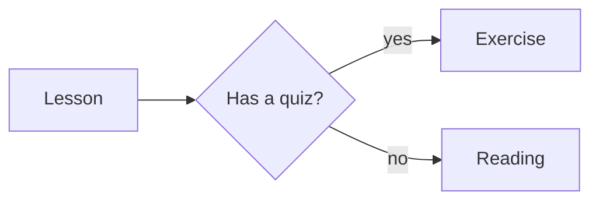
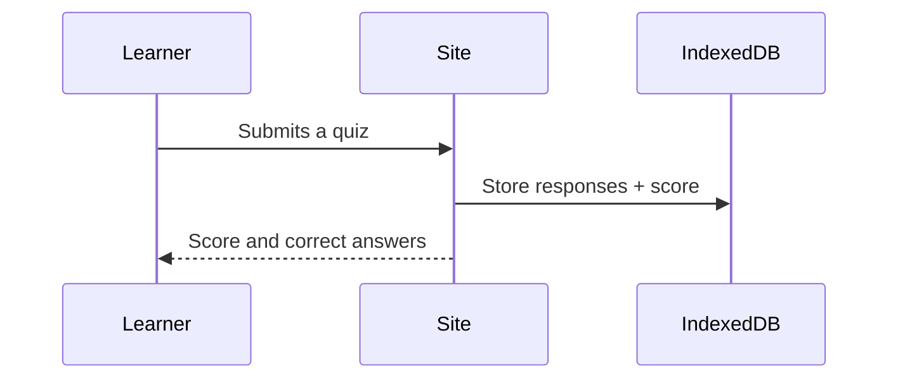

# Diagrams (Mermaid)

Any fenced code block tagged `mermaid` renders as a diagram instead of code:

````markdown

````

Diagrams are **text**, so they diff and review like the rest of your
content, and they restyle themselves for light and dark mode instead of
being baked-in images.

Powered by [astro-mermaid](https://www.npmjs.com/package/astro-mermaid) —
the full syntax reference is at [mermaid.js.org](https://mermaid.js.org/).

## Where diagrams work

- **Lesson, chapter, and course bodies** — anywhere prose goes.
- **Glossary term bodies** and **flashcard deck descriptions**.
- **Not** in question prompts, flashcard fronts/backs, or test
  `instructions`. Those are rendered through a smaller build-time markdown
  pipeline (`lib/content/markdown.ts`) that doesn't include the diagram
  transform. Put the diagram in the lesson body beside the quiz instead.

## Common types



`flowchart`, `sequenceDiagram`, `stateDiagram-v2`, `classDiagram`, `erDiagram`,
`gantt`, `pie`, `mindmap`, and `gitGraph` are all available.

## Theming

Diagrams follow the reader's light/dark setting automatically (mermaid's
`default` and `dark` themes), switching live when the visitor changes the
theme in Settings or their OS flips at sunset. They do **not** pick up the
site's colour palette (Boring / Gruvbox / Forrest) — mermaid has its own
theme system, so a diagram looks the same under every palette.

## Offline and size

The mermaid renderer is bundled with the site — no CDN — so diagrams work
offline like everything else. It's a big dependency: roughly **3.5 MB of
build output** (a few hundred KB gzipped over the wire), and the service
worker precaches it on every site whether or not any content uses a
diagram. If your courses have no diagrams and you care about the initial
download (a conference with bad WiFi, say), turn it off in
`astro.config.mjs`:

```js
const mermaidDiagrams = false;
```

With it off, ```` ```mermaid ```` blocks render as ordinary syntax-
highlighted code.

## Gotchas

- **Indentation matters** inside a diagram, and a syntax error renders a
  red error box in place of the diagram rather than failing the build —
  check your pages after adding one.
- **Escape a diagram you want shown as code** by wrapping the example in a
  longer fence (four backticks), as this page does.
- Diagrams render in the browser after the page loads, so there's a brief
  placeholder on first paint. Very large diagrams scroll horizontally
  inside their block.
