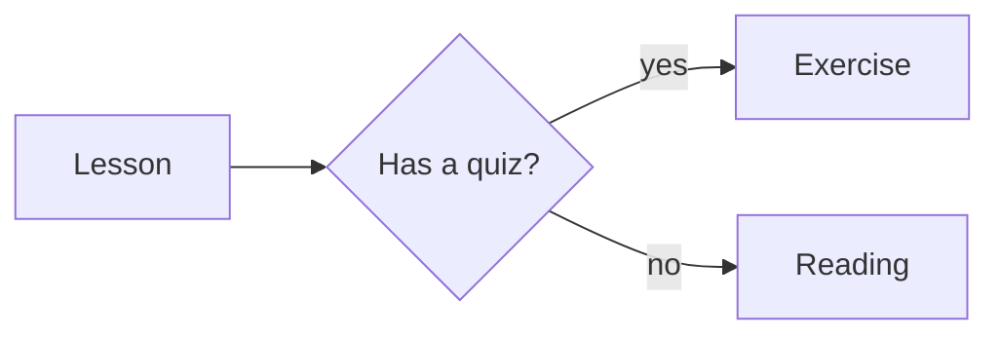

Lesson bodies are plain markdown — the same syntax as GitHub readmes. If you
know it, skip to the quiz. If not, this is 90% of what you'll use (with more details [here](https://www.markdownguide.org/basic-syntax/)):

## The essentials

```markdown
## A heading            (# = h1, ## = h2, ### = h3…)

Plain paragraphs are just text separated by blank lines.

**bold**, *italic*, and `inline code`.

- a bullet list
- with items

1. a numbered list
2. in order

[a link](https://example.com)

> a quote block
```

Fenced code blocks get syntax highlighting automatically:

````markdown
```js
const x = 1;
```
````

## Two platform extras

Beyond standard markdown, lesson bodies support **glossary references** —
`[[term]]` or `[[term|display text]]` — which become hoverable definition
links. 

For example `[[frontmatter|Frontmetter]]` becomes [[frontmatter|Frontmatter]] (More on authoring those in chapter 3.)

## Images

Put the image file **next to the lesson** and reference it with a relative
path — the build optimizes it (WebP, sized, lazy-loaded) and it works
offline and under sub-path deploys automatically:

```markdown

```

renders as:


(The image file lives beside this lesson's `.md`; image files aren't
content, so they don't need wiring into any list.)

## Diagrams

A fenced code block tagged `mermaid` becomes a **diagram** — written as
text, so it lives in version control and restyles itself for light and dark
mode:

````markdown

````

renders as:


Flowcharts, sequence diagrams, state diagrams, pie charts, Gantt charts and
more are available — see [mermaid.js.org](https://mermaid.js.org/) for the
full syntax. Diagrams render in the reader's browser and work offline like
everything else.

And remember the split: the markdown *body* is prose; everything structured —
titles, quizzes, ordering — lives in the frontmatter above it, which the next
lesson covers.

